# Diagram Use Case - Sistem Manajemen Proyek (WeProject)

## Aktor
1. **Guest** - Pengunjung yang belum login
2. **Admin** - Administrator sistem (role: ADMIN)
3. **Manager** - Manajer proyek (role: MANAGER)
4. **Member** - Anggota tim (role: MEMBER)

---

## Diagram Use Case (Mermaid)

```mermaid
graph TB
    subgraph Authentication["🔐 Authentication"]
        UC1[Login]
        UC2[Register]
        UC3[Logout]
    end
    
    subgraph Dashboard["📊 Dashboard"]
        UC4[View Dashboard]
        UC5[Receive Deadline Notification]
    end
    
    subgraph Project["📁 Project Management"]
        UC6[View Projects List]
        UC7[View Project Detail]
        UC8[Create Project]
        UC9[Update Project]
        UC10[Delete Project]
        UC11[Search Projects]
        UC12[Filter Projects by Status]
    end
    
    subgraph Task["✅ Task Management"]
        UC13[View Tasks]
        UC14[View Task Detail]
        UC15[Create Task]
        UC16[Update Task]
        UC17[Delete Task]
        UC18[Update Task Status]
    end
    
    subgraph Team["👥 Team Management"]
        UC19[View Teams List]
        UC20[View Team Detail]
        UC21[Create Team]
        UC22[Update Team]
        UC23[Delete Team]
        UC24[View Team Members]
    end
    
    subgraph User["👤 User Management"]
        UC25[View Users List]
        UC26[Create User]
        UC27[Delete User]
    end
    
    subgraph Document["📄 Document Management"]
        UC28[View Documents]
        UC29[View Document Detail]
        UC30[Upload Document]
        UC31[Update Document]
        UC32[Delete Document]
        UC33[Download Document]
    end
    
    subgraph Comment["💬 Comment Management"]
        UC34[View Comments]
        UC35[Create Comment]
        UC36[Update Comment]
        UC37[Delete Comment]
        UC38[Pin Comment]
    end
    
    subgraph Profile["👤 Profile"]
        UC39[View Profile]
        UC40[Update Profile]
    end
    
    %% Guest Use Cases
    Guest --> UC1
    Guest --> UC2
    
    %% All Authenticated Users
    Admin --> UC3
    Manager --> UC3
    Member --> UC3
    
    Admin --> UC4
    Manager --> UC4
    Member --> UC4
    
    Admin --> UC5
    Manager --> UC5
    Member --> UC5
    
    Admin --> UC6
    Manager --> UC6
    Member --> UC6
    
    Admin --> UC7
    Manager --> UC7
    Member --> UC7
    
    Admin --> UC11
    Manager --> UC11
    Member --> UC11
    
    Admin --> UC12
    Manager --> UC12
    Member --> UC12
    
    Admin --> UC13
    Manager --> UC13
    Member --> UC13
    
    Admin --> UC14
    Manager --> UC14
    Member --> UC14
    
    Admin --> UC18
    Manager --> UC18
    Member --> UC18
    
    Admin --> UC28
    Manager --> UC28
    Member --> UC28
    
    Admin --> UC29
    Manager --> UC29
    Member --> UC29
    
    Admin --> UC30
    Manager --> UC30
    Member --> UC30
    
    Admin --> UC33
    Manager --> UC33
    Member --> UC33
    
    Admin --> UC34
    Manager --> UC34
    Member --> UC34
    
    Admin --> UC35
    Manager --> UC35
    Member --> UC35
    
    Admin --> UC39
    Manager --> UC39
    Member --> UC39
    
    Admin --> UC40
    Manager --> UC40
    Member --> UC40
    
    %% Admin Only
    Admin --> UC8
    Admin --> UC9
    Admin --> UC10
    Admin --> UC15
    Admin --> UC16
    Admin --> UC17
    Admin --> UC19
    Admin --> UC20
    Admin --> UC21
    Admin --> UC22
    Admin --> UC23
    Admin --> UC24
    Admin --> UC25
    Admin --> UC26
    Admin --> UC27
    Admin --> UC31
    Admin --> UC32
    Admin --> UC36
    Admin --> UC37
    Admin --> UC38
    
    %% Manager Only
    Manager --> UC8
    Manager --> UC9
    Manager --> UC15
    Manager --> UC16
    Manager --> UC17
    Manager --> UC19
    Manager --> UC20
    Manager --> UC21
    Manager --> UC22
    Manager --> UC31
    Manager --> UC32
    Manager --> UC36
    Manager --> UC37
    Manager --> UC38
    
    %% Styling
    classDef guestClass fill:#e1f5ff
    classDef adminClass fill:#ffcccc
    classDef managerClass fill:#fff4cc
    classDef memberClass fill:#ccffcc
    classDef allUserClass fill:#f0f0f0
    
    class UC1,UC2 guestClass
    class UC25,UC26,UC27 adminClass
    class UC8,UC9,UC10,UC15,UC16,UC17,UC19,UC20,UC21,UC22,UC23,UC24 adminClass
    class UC31,UC32,UC36,UC37,UC38 adminClass
```

---

## Detail Use Case per Aktor

### 🔐 Guest
- **Login** - Masuk ke sistem
- **Register** - Daftar akun baru

### 👤 Member (Authenticated User)
#### Dashboard
- View Dashboard - Melihat dashboard dengan statistik proyek, tugas, dan notifikasi
- Receive Deadline Notification - Menerima notifikasi deadline proyek/tugas H-1

#### Project
- View Projects List - Melihat daftar proyek yang terlibat (sebagai manager atau anggota tim)
- View Project Detail - Melihat detail proyek
- Search Projects - Mencari proyek
- Filter Projects by Status - Filter proyek berdasarkan status

#### Task
- View Tasks - Melihat daftar tugas dalam proyek
- View Task Detail - Melihat detail tugas
- Update Task Status - Mengubah status tugas (untuk tugas yang di-assign)

#### Document
- View Documents - Melihat dokumen dalam proyek/tugas
- View Document Detail - Melihat detail dokumen
- Upload Document - Upload dokumen
- Download Document - Download dokumen

#### Comment
- View Comments - Melihat komentar (dengan filter privacy)
- Create Comment - Membuat komentar baru

#### Profile
- View Profile - Melihat profil sendiri
- Update Profile - Update profil sendiri

### 👨‍💼 Manager (Semua fitur Member +)
#### Project
- Create Project - Membuat proyek baru
- Update Project - Update proyek (proyek yang dimanage atau semua proyek)
- Delete Project - Hapus proyek (proyek yang dimanage)

#### Task
- Create Task - Membuat tugas baru
- Update Task - Update tugas (tugas yang dibuat atau semua tugas)
- Delete Task - Hapus tugas (tugas yang dibuat atau semua tugas)

#### Team
- View Teams List - Melihat daftar tim
- View Team Detail - Melihat detail tim
- Create Team - Membuat tim baru
- Update Team - Update tim
- View Team Members - Melihat anggota tim

#### Document
- Update Document - Update dokumen (yang diupload sendiri atau semua)
- Delete Document - Hapus dokumen (yang diupload sendiri atau semua)

#### Comment
- Update Comment - Update komentar (yang dibuat sendiri atau semua)
- Delete Comment - Hapus komentar (yang dibuat sendiri atau semua)
- Pin Comment - Pin komentar

### 👑 Admin (Semua fitur Manager +)
#### Project
- Delete Project - Hapus semua proyek
- Update Project - Update semua proyek

#### Task
- Delete Task - Hapus semua tugas
- Update Task - Update semua tugas

#### Team
- Delete Team - Hapus tim
- Update Team - Update semua tim

#### User
- View Users List - Melihat daftar semua user
- Create User - Membuat user baru
- Delete User - Hapus user

#### Document
- Update Document - Update semua dokumen
- Delete Document - Hapus semua dokumen

#### Comment
- Update Comment - Update semua komentar
- Delete Comment - Hapus semua komentar
- Pin Comment - Pin komentar

---

## Catatan Penting

### Akses Berdasarkan Role:
1. **ADMIN**: Akses penuh ke semua fitur
2. **MANAGER**: Dapat membuat/mengelola proyek, tugas, tim, dokumen, dan komentar
3. **MEMBER**: Hanya dapat melihat dan berinteraksi dengan proyek/tugas yang terlibat, serta membuat komentar dan upload dokumen

### Filter Data:
- **Admin**: Melihat semua data tanpa filter
- **Manager/Member**: Hanya melihat proyek yang:
  - Dikelola sebagai manager (`manager_id = user_id`)
  - Terlibat melalui tim (`user_id` ada di `team_members` yang terhubung ke `project_team`)

### Privacy Comment:
- **ALL_MEMBERS**: Semua anggota tim dapat melihat
- **MANAGER_AND_ME**: Hanya manager dan pembuat komentar yang dapat melihat

### Ownership Rules:
- User dapat mengedit/menghapus resource yang mereka buat (project creator, task creator, document uploader, comment author)
- Manager dapat mengedit/menghapus resource dalam proyek yang mereka manage
- Admin dapat mengedit/menghapus semua resource

