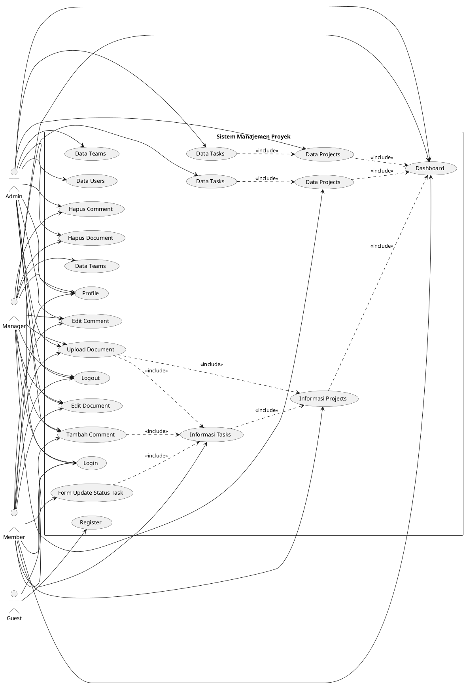

# Use Case Diagram Sistem Manajemen Proyek

## Deskripsi Use Case Diagram

Use Case Diagram ini menggambarkan interaksi antara aktor (Guest, Admin, Manager, Member) dengan sistem manajemen proyek berdasarkan kode yang ada.

### Aktor (Actors):
1. **Guest** - Pengguna yang belum login (hanya bisa register dan login)
2. **Admin** - Administrator sistem dengan akses penuh
3. **Manager** - Manager proyek yang dapat mengelola projects, tasks, dan teams
4. **Member** - Anggota tim yang dapat melihat dan berinteraksi dengan projects/tasks yang terlibat

### Use Cases:

#### Use Case Umum (Common):
- **Login** - Digunakan oleh semua aktor untuk masuk ke sistem
- **Register** - Digunakan oleh Guest untuk membuat akun baru

#### Use Case Admin:
- **Data Projects** - Kelola data proyek (Create, Read, Update, Delete)
- **Data Tasks** - Kelola data tugas (Create, Read, Update, Delete)
- **Data Teams** - Kelola data tim (Create, Read, Update, Delete)
- **Data Users** - Kelola data pengguna (Create, Read, Update, Delete)

#### Use Case Manager:
- **Data Projects** - Kelola data proyek yang menjadi tanggung jawabnya
- **Data Tasks** - Kelola data tugas dalam proyek yang di-manage
- **Data Teams** - Kelola data tim

#### Use Case Member:
- **Informasi Projects** - Melihat informasi proyek yang terlibat
- **Informasi Tasks** - Melihat informasi tugas yang ditugaskan
- **Update Status Task** - Mengupdate status tugas yang ditugaskan

#### Use Case Semua Role (Setelah Login):
- **Dashboard** - Melihat dashboard dengan statistik sesuai role
- **Profile** - Melihat informasi profile sendiri
- **Upload Document** - Mengunggah dokumen (dengan permission)
- **Edit Document** - Mengedit dokumen yang diupload sendiri
- **Hapus Document** - Menghapus dokumen (Admin/Manager/Owner)
- **Tambah Comment** - Menambahkan komentar pada task
- **Edit Comment** - Mengedit komentar sendiri
- **Hapus Comment** - Menghapus komentar (Admin/Manager/Owner)
- **Logout** - Keluar dari sistem

---

## PlantUML Code untuk Generate Diagram



---

## Visual Representation (Text-based Structure)

```
                                [Guest]
                                  |
                        +---------+---------+
                        |                   |
                    [Register]          [Login]
                        |                   |
                        |           +-------+-------+--------+
                        |           |               |        |
                [Sistem Manajemen Proyek]          |        |
                        |                           |        |
    +-------------------+--------------------+      |        |
    |                    |                    |      |        |
[Admin]              [Manager]            [Member]  |        |
    |                    |                    |      |        |
    |--[Data Projects]   |--[Data Projects]   |      |        |
    |--[Data Tasks]      |--[Data Tasks]      |      |        |
    |--[Data Teams]      |--[Data Teams]      |      |        |
    |--[Data Users]      |                    |      |        |
    |                    |                    |--[Informasi Projects]
    |                    |                    |--[Informasi Tasks]
    |                    |                    |--[Form Update Status Task]
    |                    |                    |      |        |
    +--------------------+--------------------+      |        |
            |                   |                    |        |
    [Dashboard]          [Profile]              [Upload Document]
    [Documents]          [Comments]             [Edit Document]
    [Logout]             [Hapus Document]       [Add Comment]
                          [Edit Comment]        [Hapus Comment]
                                                [Logout]
```

## Diagram Struktur Lengkap dengan Dependency

```
LEFT SIDE (Admin & Manager)          CENTER (System)              RIGHT SIDE (Member & Guest)

      [Admin]                    [Login]                          [Guest]
         |                          |                                |
         +-----------+              |                                +---+
                     |              |                                    |
         [Data Projects]            |                                [Register]
         [Data Tasks]               |                                    |
         [Data Teams]               |                                    |
         [Data Users]               |                                    |
                     |              |                                    |
      [Manager]      |              |                                [Member]
         |           |              |                                |
         +-----------+              |                                |
                     |              |                                +---+
         [Data Projects]            |                                    |
         [Data Tasks]               |                                [Informasi Projects]
         [Data Teams]               |                                [Informasi Tasks]
                     |              |                                [Form Update Status Task]
                     |              |                                    |
                     +--------------+--------------+                     |
                                  |                  |                  |
                          [Dashboard]          [Profile]            |
                                  |                  |                  |
                          [Upload Document]   [Tambah Comment]      |
                          [Edit Document]     [Edit Comment]        |
                          [Hapus Document]    [Hapus Comment]       |
                                              [Logout]               |

Dependency Relationships:
- Data Projects → Dashboard (include)
- Data Tasks → Data Projects (include)  
- Informasi Tasks → Informasi Projects (include)
- Form Update Status Task → Informasi Tasks (include)
- Upload Document → Projects/Tasks (include)
- Comments → Tasks (include)
```

---

## Penjelasan Relasi

### Relasi Aktor dengan Use Case:

1. **Guest** terhubung dengan:
   - Register (membuat akun baru)
   - Login (masuk ke sistem)

2. **Admin** terhubung dengan:
   - Login
   - Data Projects (CRUD projects)
   - Data Tasks (CRUD tasks)
   - Data Teams (CRUD teams)
   - Data Users (CRUD users - hanya Admin)
   - Dashboard (melihat statistik lengkap)
   - Profile
   - Upload Document
   - Edit Document
   - Hapus Document (semua dokumen)
   - Tambah Comment
   - Edit Comment
   - Hapus Comment (semua komentar)
   - Logout

3. **Manager** terhubung dengan:
   - Login
   - Data Projects (CRUD projects yang di-manage)
   - Data Tasks (CRUD tasks dalam project yang di-manage)
   - Data Teams (CRUD teams)
   - Dashboard (melihat statistik projects yang di-manage)
   - Profile
   - Upload Document
   - Edit Document
   - Hapus Document (semua dokumen dalam project yang di-manage)
   - Tambah Comment
   - Edit Comment
   - Hapus Comment (semua komentar dalam project yang di-manage)
   - Logout

4. **Member** terhubung dengan:
   - Login
   - Informasi Projects (melihat projects yang terlibat)
   - Informasi Tasks (melihat tasks yang ditugaskan)
   - Update Status Task (mengupdate status task yang ditugaskan)
   - Dashboard (melihat tasks yang ditugaskan dan deadline)
   - Profile
   - Upload Document (upload dokumen sendiri)
   - Edit Document (edit dokumen yang diupload sendiri)
   - Tambah Comment (menambahkan komentar pada task)
   - Edit Comment (edit komentar sendiri)
   - Logout

### Relasi Dependencies (Include):

- Data Projects/Tasks/Teams menggunakan Dashboard untuk menampilkan informasi
- Data Tasks termasuk dalam Data Projects (tasks terkait dengan projects)
- Informasi Tasks termasuk dalam Informasi Projects
- Update Status Task termasuk dalam Informasi Tasks
- Upload Document dapat dilakukan dari Projects atau Tasks
- Komentar dilakukan pada Tasks

---

## Catatan Implementasi

Berdasarkan kode yang ada:

1. **Permission Control:**
   - Admin dapat mengakses semua fitur
   - Manager hanya dapat mengelola projects yang menjadi manager-nya
   - Member hanya dapat melihat dan berinteraksi dengan projects/tasks yang terlibat melalui team membership

2. **Filter Berdasarkan Role:**
   - Projects: Admin lihat semua, Manager/Member hanya yang terlibat
   - Tasks: Admin/Manager dapat manage semua tasks dalam projects mereka, Member hanya update status tasks yang ditugaskan
   - Documents: Semua role dapat upload, namun hanya Admin/Manager/Owner yang dapat hapus
   - Comments: Semua role dapat buat/edit/hapus komentar sendiri, Admin/Manager dapat hapus semua komentar

3. **Dependencies dalam Kode:**
   - Semua fitur memerlukan login (auth_check.php)
   - Projects memiliki relasi dengan Teams melalui project_team
   - Tasks memiliki relasi dengan Projects
   - Documents dapat terkait dengan Projects atau Tasks
   - Comments terkait dengan Tasks

